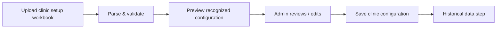
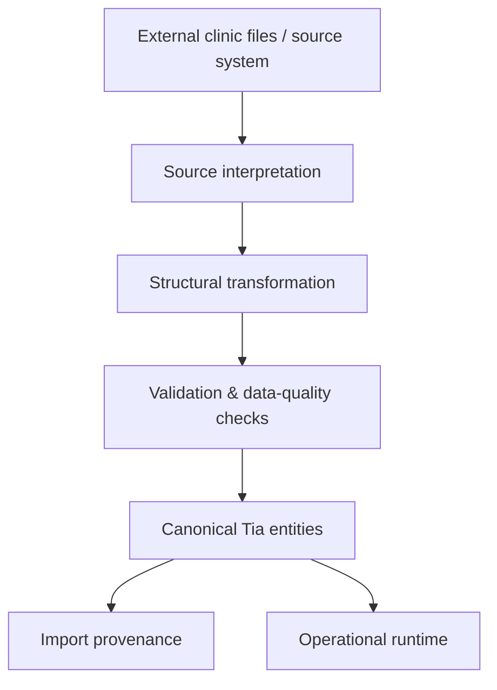
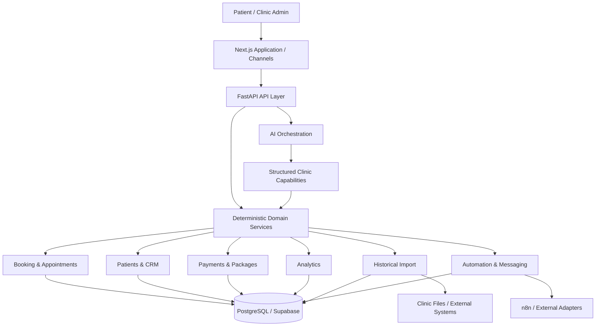
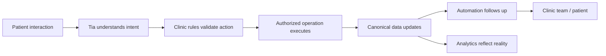

<div align="center">

# Tia AI

### AI-native operations platform for aesthetic clinics

Tia unifies patient conversations, booking, clinic configuration, CRM, payments, treatment packages, historical data migration, automation, and analytics behind one operational platform.

[](https://github.com/GirgesAdam/Tia_AI/actions/workflows/ci.yml)


**FastAPI · Next.js · PostgreSQL · Supabase · SQLAlchemy · Alembic · Google GenAI · n8n**

</div>

---

## What is Tia?

Tia is an AI-powered operating layer for aesthetic and cosmetic clinics.

It is designed around a simple idea: a clinic should not need separate disconnected workflows for patient messaging, appointment scheduling, doctors, services, payments, packages, CRM, follow-ups, analytics, and legacy data.

Tia brings those workflows into one canonical system and exposes them through both a structured admin application and an AI agent.

The AI is responsible for understanding intent and selecting capabilities. The backend is responsible for deciding what is actually valid.

> **AI interprets. Domain services validate. PostgreSQL records the truth.**

That boundary is central to the project. Booking rules, patient identity, financial accounting, package consumption, refunds, historical imports, and analytics are implemented as deterministic application logic rather than delegated to an LLM.

---

## Why Tia is different

Many AI assistants stop at conversation. Tia is built to operate against real clinic state.

Instead of this:

```text
Patient asks for an appointment
        ↓
LLM generates a plausible answer
```

Tia follows this model:

```text
Patient / Admin request
        ↓
AI understands the request
        ↓
Capability / tool selection
        ↓
Deterministic clinic service
        ↓
Authorization + business rules
        ↓
Canonical database mutation
        ↓
Audit / operational state
        ↓
Grounded response
```

This makes the AI layer flexible without making core clinic operations probabilistic.

### Tia is not

- A chatbot with appointment data pasted into a prompt.
- An LLM acting as the payment ledger.
- Regex or keyword routing disguised as an agent.
- A reporting layer that asks AI to guess metrics from raw records.
- A migration script that merges patients because their names look similar.

---

# Product capabilities

## 1. AI clinic agent

Tia includes an AI orchestration layer for patient-facing and administrative workflows.

The agent can work with structured clinic capabilities for areas such as:

- Service and clinic information
- Doctor discovery
- Availability lookup
- Appointment booking
- Rescheduling and cancellation
- Patient history
- Operational actions
- Clinic knowledge
- Follow-up workflows
- Analytics selection and explanation

Natural-language interpretation remains separate from deterministic domain execution.

The runtime is designed around semantic interpretation and structured tool selection rather than brittle keyword/regex routing.

---

## 2. Clinic onboarding and configuration

Tia includes an onboarding flow for configuring a clinic before operational use.

Configuration covers:

- Clinic profile
- Branch configuration
- Services
- Doctors
- Doctor/service relationships
- Clinic working hours
- Doctor working hours
- Visiting-doctor availability
- Booking policies

The current V1 setup experience presents a streamlined single-clinic configuration while retaining branch-aware domain models internally.

### Excel-assisted setup

Clinic setup can also be loaded from a structured Excel workbook.

The workflow is preview-first:



Missing workbook values stay missing rather than being fabricated by the AI. The administrator remains responsible for the saved configuration.

---

## 3. Services and pricing

Services are represented as operational entities with fields such as:

- Name
- Optional category
- Duration
- Price

Doctor/service relationships determine which doctors can perform which treatments.

Service duration is part of real booking availability calculation rather than display-only metadata.

---

## 4. Doctor scheduling

Tia supports different scheduling models for different doctor types.

### Regular doctors

Regular doctors use recurring weekly working hours.

### Visiting doctors

Visiting doctors use dated availability windows rather than permanent recurring schedules.

This allows the booking engine to support specialists who only attend the clinic on specific dates.

Doctors discovered only in historical data can be retained as passive historical entities without automatically making them available for future booking.

---

## 5. Deterministic booking engine

The AI does not invent appointment availability.

Availability is calculated from clinic state including:

- Clinic hours
- Doctor hours
- Visiting-doctor windows
- Doctor/service eligibility
- Appointment duration
- Existing appointments
- Booking notice rules
- Booking horizon
- Same-day booking policy

Appointment lifecycle states include:

```text
pending
confirmed
checked_in
in_progress
completed
cancelled
no_show
rescheduled
```

Operational transitions and appointment history are persisted in the backend.

---

## 6. Canonical patient management

Patient data can enter Tia through multiple workflows:

- Historical imports
- Conversations
- Appointments
- CRM
- Administrative actions
- Clinic integrations

Tia maintains a canonical patient record so those workflows operate against one identity model.

### Conservative identity resolution

Historical patient identity is resolved using strong identifiers:

```text
external patient_id
OR
normalized phone number
```

A patient is **never merged by name alone**.

This matters in real clinics where different patients may have identical or very similar names.

Later imports can enrich missing patient facts, but blank or conflicting presentation data does not silently erase established canonical information.

Phone ownership is also protected so one imported patient cannot accidentally steal a canonical phone number from another patient.

---

## 7. Patient timeline and history

The platform contains patient-oriented views and backend services for combining operational history into a useful timeline.

Relevant domains include:

- Appointments
- Payments
- Packages
- Notes
- Tags
- CRM activity
- Conversation-related activity

This provides a shared operational context for both clinic staff and AI-assisted workflows.

---

## 8. Historical data migration

Existing clinics rarely start from an empty database.

Tia includes a historical import pipeline for bringing legacy clinic records into the canonical data model.

Supported historical domains include:

- Patients
- Appointments
- Payments
- Treatment packages
- Explicit payment allocations

### Designed for inconsistent clinic data

External clinic exports do not need to have exactly the same structure as Tia.

The integration/import architecture separates source interpretation from canonical persistence:



This architecture can accommodate different column names, split tables, combined tables, and different source-system structures without changing the canonical business model for every clinic.

### Preview before apply

Historical data is previewed and validated before import.

The system can report recognized entity counts, issues, and rows requiring attention before committing canonical records.

### Append and Replace semantics

Tia supports controlled historical import behavior.

**Append** adds new source history while protecting immutable imported facts.

**Replace previous imports** can replace records owned by previous historical imports while protecting runtime data created later inside Tia.

Patients are treated as durable master identities rather than disposable imported rows.

### Provenance

Imported source records retain links to their canonical entities.

That makes it possible to answer questions such as:

- Which batch created this record?
- Has this source row been imported before?
- Did its payload change?
- Is replacing it safe?

---

## 9. Payments ledger

Payments are modeled as explicit financial transactions rather than arbitrary fields attached to appointments.

Tia supports payment and refund semantics, payment methods, references, and allocation records.

Historical import treats transaction direction explicitly:

```text
positive amount → payment
negative amount → refund
```

Missing historical relationships are not invented merely to make imported data look complete.

---

## 10. Payment allocations

A payment can be separated from what it paid for.

```text
Payment transaction
        ↓
Explicit allocation
        ↓
Appointment / financial target
```

This distinction gives the analytics and financial layers stronger semantics than relying on a single `amount_paid` field on an appointment.

Historical allocations are only imported when the source data provides explicit evidence for them.

---

## 11. Treatment packages

Tia supports treatment packages with operational concepts such as:

- Patient ownership
- Service relationship
- Session totals
- Remaining sessions
- Purchase transaction
- Appointment linkage
- Package usage
- Refund eligibility

Historical opening balances and live runtime consumption are kept conceptually separate.

### No-show behavior

For package consumption, a no-show behaves like a cancellation and does not consume a package session.

---

## 12. Package refund accounting

Package refunds use deterministic financial rules.

When a patient purchases a discounted package, consumes some sessions, and later requests a refund, consumed sessions are repriced using the normal standalone session value.

Example:

```text
Package payment                  8,000 EGP
Standalone session price         2,500 EGP
Sessions consumed                        1
                                ----------
Consumed value                   2,500 EGP
Refund                           5,500 EGP
```

The customer therefore loses the package discount on sessions already consumed.

This calculation belongs to backend business logic, not LLM reasoning.

---

## 13. CRM

Tia includes CRM-oriented domain capabilities for managing patient relationships beyond a single appointment.

The repository contains support for concepts including:

- Leads
- CRM tasks
- Cohorts
- Cohort members
- Patient notes
- Patient tags
- Campaigns
- Campaign conversion attribution

This gives the platform a path from reactive appointment handling to lifecycle-oriented clinic operations.

---

## 14. Inbox, conversations, and handoff

Tia contains persistent conversation infrastructure rather than treating each AI message as stateless.

The messaging domain includes concepts such as:

- Conversations
- Messages
- Channel identities
- Inbound events
- Delivery events
- Message dispatches
- Conversation flow state
- Flow events
- Handoff requests
- Handoff events

Human handoff exists as a first-class operational concept so ambiguous or sensitive conversations can move away from automation when needed.

---

## 15. Automation engine

Tia includes an automation layer built around durable operational records.

Core concepts include:

- Automation rules
- Automation jobs
- Automation workers
- Appointment-triggered jobs
- CRM follow-up jobs
- Outbound communication workflows

The goal is to make automation traceable and linked to concrete clinic entities instead of executing unstructured background prompts.

---

## 16. Analytics and business intelligence

Tia's analytics architecture intentionally avoids using an LLM as a calculator over raw clinic data.

Metrics are generated from deterministic analytics services and canonical records.

The repository contains analytics capabilities covering areas such as:

- Clinic overview
- Appointment activity
- Patient activity
- Service performance
- Doctor performance
- Revenue and payments
- Capacity
- Packages
- CRM audiences and cohorts
- Campaign attribution
- Saved analytics views
- Analytics exports
- Data-integrity checks

The AI layer can help interpret a request or explain a result, but it does not become the source of the numeric result.

---

## 17. Clinic integration layer

Tia is designed to sit on top of real clinic operations rather than require every clinic to use the same legacy database schema.

The repository includes an integration framework with components for:

- Clinic integration configuration
- External entity linking
- Read-only PostgreSQL connectors
- Tabular imports
- Structural transformation
- Source-to-canonical mapping
- Integration synchronization
- Sync schedules and runtime state

The canonical Tia model remains stable while connector-specific code handles differences in external systems.

---

## 18. n8n and external workflow orchestration

`n8n` is part of the repository's integration and automation story.

It can be used to coordinate external services and delivery workflows while Tia retains clinic-domain authority.

The intended separation is:

```text
Tia
  ├── decides clinic-domain validity
  ├── persists operational truth
  └── creates durable actions/jobs
             ↓
            n8n / adapters
             ↓
      external services
```

This avoids putting booking, payment, or package business rules inside external automation workflows.

---

# Admin application

The Next.js application exposes operational surfaces including:

- Dashboard
- Appointments
- Patients
- Patient details
- Inbox
- Tasks
- Analytics
- Campaign analytics
- Automations
- Channels
- Clinic knowledge
- Activity
- Team
- Clinic setup
- Historical-data integration

The UI is backed by the same canonical APIs used by agent capabilities.

---

# Architecture



For more detail, see [`docs/ARCHITECTURE.md`](docs/ARCHITECTURE.md).

---

# Engineering principles

## Deterministic business truth

Generative AI can choose capabilities and formulate responses. It does not define transactional truth.

High-risk logic stays deterministic, including:

- Appointment availability
- Patient identity
- Appointment transitions
- Payment accounting
- Payment allocations
- Package usage
- Package refunds
- Historical import semantics
- Analytics calculations

## Canonical data model

External systems are transformed into Tia's domain instead of leaking source-specific schemas throughout the application.

## Conservative data mutation

When source data is ambiguous, Tia prefers preserving established canonical facts over aggressive inference.

## Explicit provenance

Historical imports retain ownership and provenance so destructive replacement can be constrained safely.

## Human control

Admin-facing AI workflows are designed to support review and explicit actions where appropriate.

## No runtime keyword routing

Natural-language routing should not depend on hard-coded keyword or regex branches.

## Financial semantics are explicit

Payments, refunds, allocations, and package consumption are represented as real domain records rather than inferred conversational state.

---

# Feature maturity

This repository is an actively developed product codebase. The table below distinguishes implemented application domains from integration infrastructure whose production behavior depends on deployment and provider configuration.

| Area | Repository status |
|---|---|
| Workspace/auth foundation | Implemented |
| Clinic setup & booking settings | Implemented |
| Services & doctor configuration | Implemented |
| Regular + visiting doctor schedules | Implemented |
| Appointment booking lifecycle | Implemented |
| Canonical patient model | Implemented |
| Patient history/timeline | Implemented |
| Historical import preview/apply | Implemented |
| Import provenance + append/replace rules | Implemented |
| Payment transactions & refunds | Implemented |
| Explicit payment allocations | Implemented |
| Treatment packages | Implemented |
| Package refund business rules | Implemented |
| CRM tasks/cohorts/tags/notes | Implemented |
| Campaign attribution analytics | Implemented |
| Deterministic analytics catalog/services | Implemented |
| Saved analytics views / exports | Implemented |
| Inbox/conversation domain | Implemented |
| Human handoff domain | Implemented |
| Automation rule/job infrastructure | Implemented |
| Clinic integration framework | Implemented |
| External provider connectivity | Environment/provider dependent |
| n8n workflows | Integration infrastructure |
| Production deployment configuration | Environment specific |

> Feature availability in a deployed environment depends on applied migrations, credentials, provider configuration, channel setup, and enabled integrations.

---

# Repository structure

```text
tia-ai/
├── backend/
│   ├── alembic/                 # Database migrations
│   ├── app/
│   │   ├── agents/              # AI orchestration and tool selection
│   │   ├── api/                 # FastAPI routes/dependencies
│   │   ├── database/            # SQLAlchemy session/base
│   │   ├── integrations/        # Clinic connector framework
│   │   ├── models/              # Canonical database models
│   │   ├── schemas/             # API/domain schemas
│   │   └── services/            # Deterministic application services
│   ├── scripts/                 # Operational/admin utilities
│   └── tests/                   # Backend test suites
│
├── frontend/
│   └── src/app/                 # Next.js application routes
│
├── n8n/                         # External workflow integration assets
├── docs/                        # Architecture & development documentation
├── tools/                       # Repository / development utilities
├── .github/workflows/           # CI and database migration workflows
├── .env.example
├── CONTRIBUTING.md
├── SECURITY.md
└── VERSION
```

---

# Technology stack

### Backend

- Python 3.12
- FastAPI
- SQLAlchemy 2
- Alembic
- Pydantic
- PostgreSQL / psycopg

### Frontend

- Next.js 16
- React 19
- TypeScript

### Platform

- Supabase Auth
- PostgreSQL / Supabase
- Google GenAI integration
- n8n workflow orchestration

### Quality

- pytest
- Ruff
- TypeScript type checking
- ESLint
- GitHub Actions
- Alembic migration workflow

---

# Local development

Detailed instructions are available in [`docs/LOCAL_DEVELOPMENT.md`](docs/LOCAL_DEVELOPMENT.md).

## Requirements

- Python 3.12
- Node.js 20+
- PostgreSQL / Supabase
- Supabase project credentials
- AI-provider credentials for AI-enabled flows

## 1. Clone

```bash
git clone https://github.com/GirgesAdam/Tia_AI.git
cd Tia_AI
```

## 2. Configure environment

Use `.env.example` as the configuration contract.

Never commit production credentials.

Typical variables include:

```env
DATABASE_URL=
MIGRATION_DATABASE_URL=

SUPABASE_URL=
SUPABASE_PUBLISHABLE_KEY=
SUPABASE_SECRET_KEY=

GEMINI_API_KEY=

NEXT_PUBLIC_SUPABASE_URL=
NEXT_PUBLIC_SUPABASE_PUBLISHABLE_KEY=
TIA_API_URL=http://127.0.0.1:8000
```

## 3. Backend

```powershell
cd backend
python -m venv .venv
.\.venv\Scripts\Activate.ps1
pip install -r requirements.txt
alembic upgrade head
python -m uvicorn app.main:app --reload
```

Development API:

```text
http://127.0.0.1:8000
```

API documentation is available when docs are enabled for the current environment.

## 4. Frontend

```powershell
cd frontend
npm ci
npm run dev
```

---

# Testing and quality gates

## Backend

```powershell
cd backend
ruff check app tests alembic
python -m compileall -q app alembic tests
python -m pytest -q
```

## Frontend

```powershell
cd frontend
npm run lint
npm run typecheck
```

## CI

GitHub Actions runs backend and frontend quality gates on pull requests and pushes to `main`.

The repository also contains a manually triggered database migration workflow for configured staging/production GitHub environments.

---

# Historical-import smoke verification

After loading historical clinic data, the repository includes a read-only smoke utility for validating that imported data is usable by canonical runtime services.

```powershell
cd backend
python scripts/run_post_import_smoke.py
```

The smoke gate checks areas including:

- Imported batches
- Provenance links
- Patients
- Appointment joins
- Payments and refunds
- Package opening balances
- Analytics execution

---

# Database migrations

Schema evolution is managed with Alembic.

```powershell
cd backend
alembic upgrade head
```

Production/staging migrations should be executed through an explicit controlled deployment workflow rather than silently during application startup.

---

# Security

Tia operates on potentially sensitive clinic and patient information, so repository hygiene matters.

Never commit:

- `.env` files
- Database credentials
- Supabase secret keys
- AI-provider keys
- OAuth credentials
- Webhook secrets
- Production tokens
- Patient exports
- Database dumps
- Real clinic spreadsheets

Use environment variables and deployment secret stores instead.

See [`SECURITY.md`](SECURITY.md).

---

# Development workflow

Use short-lived branches and Pull Requests for meaningful changes.

```powershell
git checkout -b fix/example-change

git add .
git commit -m "fix: correct example behavior"
git push -u origin fix/example-change
```

Recommended commit prefixes:

```text
feat:      new user-facing capability
fix:       bug fix
refactor:  internal structural improvement
test:      test coverage / regression protection
docs:      documentation
chore:     tooling / maintenance
```

Changes to high-risk domains should receive additional review and targeted regression tests, especially:

- Booking
- Patient identity
- Payments
- Packages/refunds
- Historical imports
- Migrations
- Analytics
- AI execution boundaries

See [`CONTRIBUTING.md`](CONTRIBUTING.md).

---

# Product direction

Tia is being built toward a clinic operating model where conversations and operations are connected rather than siloed.



The long-term goal is not to replace clinic systems with a chatbot.

It is to provide an **AI-native operational layer** where natural-language interaction, deterministic clinic logic, automation, integrations, and business intelligence operate on the same source of truth.

---

# Current version

The current application version is stored in [`VERSION`](VERSION).

---

# License

Tia AI is proprietary software.

Unless explicitly authorized, the source code and associated materials may not be redistributed, modified, sublicensed, or used commercially by third parties.

**All rights reserved.**
