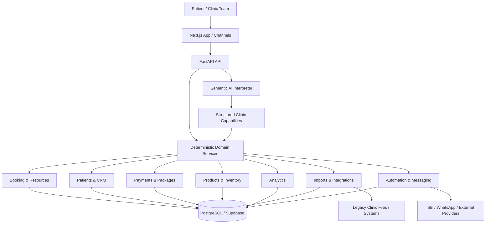

<div align="center">

# Tia AI

### AI-native operating platform for aesthetic clinics

Patient conversations, booking, clinic operations, CRM, payments, packages, inventory, automation, data migration, and analytics in one system.

[](https://github.com/GirgesAdam/Tia_AI/actions/workflows/ci.yml)


**FastAPI · Next.js · PostgreSQL · Supabase · SQLAlchemy · Alembic · OpenAI · n8n**

### [Open the live Tia application](https://app.tiaai.online)

</div>

---

## Portfolio demo access

The live application is connected only to synthetic clinic data for portfolio/demo use.

| | Demo access |
|---|---|
| **Application** | https://app.tiaai.online |
| **Email** | `demo@tiaai.online` |
| **Password** | `TiaDemo2026!` |
| **Role** | Demo member |

The demo account can explore the operational product, including dashboard data, appointments, patients, finance views, analytics, inventory, products, inbox and agent-backed workflows. Admin-only configuration is intentionally protected from the public account. Demo records may be reset periodically.

**No real patient or clinic data is used in this public portfolio environment.**

---

## What Tia is

Tia is an AI-powered operating layer for aesthetic and cosmetic clinics. It connects the patient conversation to the same operational state used by reception, booking, finance, inventory, CRM and analytics.

The central engineering boundary is:

> **AI interprets. Domain services validate. PostgreSQL records the truth.**

The LLM understands meaning and returns structured decisions. Deterministic backend services remain authoritative for availability, writes, payments, package accounting, identity resolution, inventory conversion and analytics.

Tia does **not** use keyword/regex routing as a substitute for semantic understanding, and the LLM is never treated as the source of transactional truth.

---

# Product capabilities

## AI clinic agent

The patient-facing agent works against real clinic capabilities instead of generating plausible but unverified answers. It supports workflows such as:

- service, price and clinic-information questions;
- doctor discovery and real availability;
- appointment booking, rescheduling and cancellation;
- appointment and patient history;
- package information and package-aware booking;
- customer requests and human handoff;
- grounded follow-ups across multi-turn conversations.

Recent conversational hardening includes contextual time interpretation, verified option references across harmless side questions, reschedule semantics, and ambiguity preservation when more than one doctor matches the same time.

Structured model output is validated against a strict JSON schema before deterministic execution.

## Deterministic booking engine

Availability is calculated from clinic state, including:

- clinic opening hours;
- doctor schedules and visiting-doctor windows;
- doctor/service compatibility;
- service duration and buffers;
- existing appointments;
- booking notice and horizon rules;
- resource/device availability.

Appointment lifecycle state is persisted rather than inferred from chat history.

## Laser device scheduling and pricing

Laser hair-removal services can require a physical device selection. The current device catalog includes:

- **Prime Lase**
- **Candela Gentle**

Each service can have a different price per device. Final laser availability is the intersection of clinic hours, doctor availability and the selected device's availability.

The backend prevents overlapping use of the same physical device and also prevents overlapping appointments for the same doctor, even when different devices are selected.

## Clinic setup and onboarding

Clinic configuration covers services, doctors, working hours, doctor/service relationships, booking policy and clinic knowledge. The V1 customer experience is intentionally single-location while internal models can retain location references needed by integrations.

Structured Excel-assisted setup is preview-first: values are parsed and validated, the administrator reviews the recognized configuration, then the canonical records are saved.

## Patients, CRM and timeline

Tia maintains a canonical patient record shared across appointments, conversations, CRM, payments, packages and imports.

Historical identity resolution is conservative: strong external identifiers and normalized phone numbers can establish identity; **patients are never merged by name alone**.

The CRM domain includes notes, tags, leads, tasks, cohorts, campaigns and conversion attribution.

## Payments and outstanding balances

New staff-entered payments use explicit methods:

- Cash
- Visa
- InstaPay

Payments are immutable financial transactions with explicit allocations to appointments. The finance layer supports payment-method breakdowns, refunds, outstanding appointment balances and period-based reporting.

Month views can show daily income; year views can show monthly income.

## Packages and refund accounting

Packages track patient ownership, service relationship, purchased sessions, remaining sessions, appointment usage and financial history.

A package cancellation refund is deterministic: consumed sessions are repriced at the normal standalone session price, and the remaining paid value is refundable. A no-show behaves like a cancellation for package consumption and does not consume a session.

## Products and injectable inventory

Tia includes clinic product and treatment inventory workflows.

**Clinic products** can be attached to appointments with an explicit quantity and manual unit price.

**Injectable inventory** stores stock in milliliters while staff can record usage in milligrams. Conversion uses the configured concentration (`mg/mL`) and the backend validates the resulting stock movement.

The portfolio dataset contains realistic synthetic products, injectable stock, usage history and appointment product sales so these newer surfaces are visible without manual setup.

## Inbox, conversations and handoff

Conversation state is persisted with messages, channel identities, delivery state, flow state and handoff records. Reception can take ownership of conversations when needed instead of forcing every customer turn through automation.

## Automation and external integrations

Durable rules/jobs power operational follow-up. `n8n` remains part of the external orchestration layer, while clinic-domain validity stays inside Tia.

The integration layer is designed for real clinics whose existing database/file structures differ from Tia's canonical model. Source-specific interpretation and mapping are kept separate from canonical persistence.

## Historical data migration

The import pipeline supports patients, appointments, payments, allocations and treatment packages from inconsistent source files and systems.

It supports preview/validation, provenance, append semantics and controlled replacement of previous imported records without treating runtime data as disposable import output.

## Deterministic analytics

Analytics is generated by backend analysis services over canonical records rather than asking an LLM to calculate metrics from raw text.

Current analytics domains include appointments, patients, services, doctor performance, revenue/payments, capacity, packages, CRM audiences, campaign attribution, exports and data-integrity checks.

---

# Architecture



For a deeper architectural overview, see [`docs/ARCHITECTURE.md`](docs/ARCHITECTURE.md).

---

# Engineering principles

- **Deterministic business truth:** high-risk operational rules stay in backend services.
- **Semantic, not lexical routing:** natural-language behavior is not controlled by keyword/regex branches.
- **Strict structured output:** model decisions are schema-constrained and locally validated.
- **Canonical data model:** integrations transform external structures instead of leaking them across the application.
- **Conservative identity resolution:** ambiguous patients are not aggressively merged.
- **Explicit financial semantics:** payments, allocations, package use and refunds are concrete records.
- **Human control:** handoff and reception ownership are first-class states.
- **Auditability:** operational state is persisted and linked to concrete clinic entities.

---

# Repository structure

```text
tia-ai/
├── backend/
│   ├── alembic/                 # Database migrations
│   ├── app/
│   │   ├── agents/              # Semantic AI interpretation/orchestration
│   │   ├── api/                 # FastAPI routes and dependencies
│   │   ├── integrations/        # External clinic connector framework
│   │   ├── models/              # Canonical SQLAlchemy models
│   │   ├── schemas/             # API/domain contracts
│   │   └── services/            # Deterministic business logic
│   ├── scripts/                 # Seed/admin/verification utilities
│   └── tests/                   # Backend regression suites
├── frontend/                    # Next.js 16 application
├── n8n/                         # External orchestration assets
├── deploy/                      # Deployment configuration
├── docs/                        # Architecture and operational docs
├── tools/                       # Development utilities
└── .github/workflows/           # CI and controlled operations
```

---

# Technology stack

### Backend
- Python 3.12
- FastAPI
- SQLAlchemy 2
- Alembic
- Pydantic
- PostgreSQL / psycopg

### Frontend
- Next.js 16
- React 19
- TypeScript

### Platform and integrations
- Supabase Auth + PostgreSQL
- OpenAI structured model runtime
- Railway backend services
- Vercel frontend
- n8n workflow orchestration
- WhatsApp transport/integration layer

### Quality
- pytest
- Ruff
- ESLint
- TypeScript type checking
- GitHub Actions
- clean-database Alembic migration verification

---

# Local development

Detailed setup lives in [`docs/LOCAL_DEVELOPMENT.md`](docs/LOCAL_DEVELOPMENT.md).

```bash
git clone https://github.com/GirgesAdam/Tia_AI.git
cd Tia_AI
```

Copy `.env.example` and provide local database, Supabase and model-provider credentials. Never commit secrets.

### Backend

```bash
cd backend
python -m venv .venv
# activate the virtual environment
pip install -r requirements.txt
alembic upgrade head
python -m uvicorn app.main:app --reload
```

### Frontend

```bash
cd frontend
npm ci
npm run dev
```

---

# Testing

### Backend

```bash
cd backend
ruff check app tests alembic
python -m compileall -q app alembic tests
python -m pytest -q
```

### Frontend

```bash
cd frontend
npm run lint
npm run typecheck
npm run build
```

GitHub Actions runs the main quality gates on pull requests and pushes to `main`.

---

# Security and demo-data policy

Never commit database credentials, Supabase secret keys, model-provider keys, OAuth secrets, webhook secrets, database dumps or real patient exports.

The credentials shown in **Portfolio demo access** are intentionally public credentials for a synthetic-data demo member account. They are not infrastructure secrets and do not grant access to a real clinic workspace.

See [`SECURITY.md`](SECURITY.md) and [`docs/RECRUITER_DEMO.md`](docs/RECRUITER_DEMO.md).

---

# License

Tia AI is proprietary software. Unless explicitly authorized, the source code and associated materials may not be redistributed, modified, sublicensed or used commercially by third parties.

**All rights reserved.**
